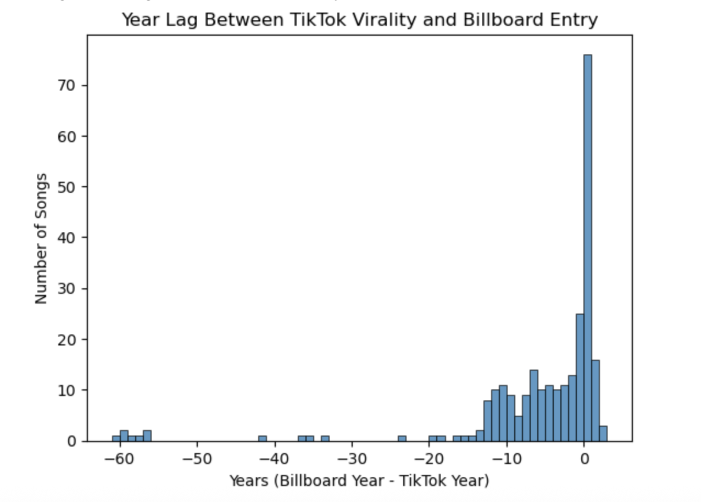
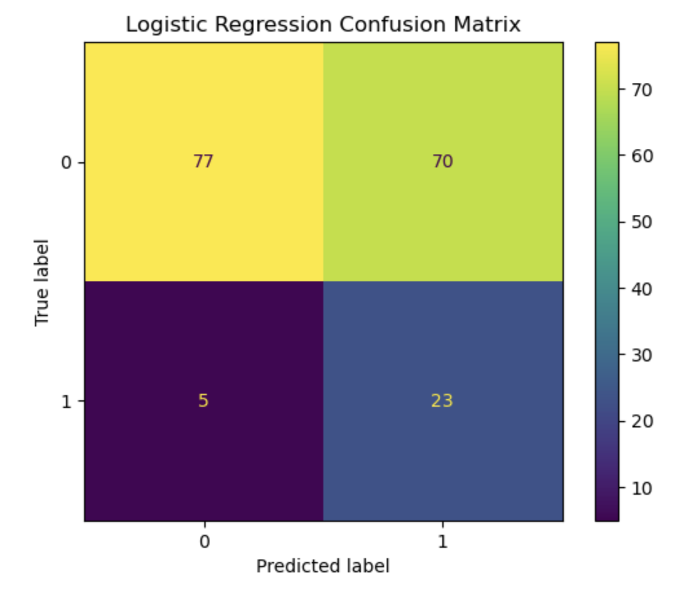
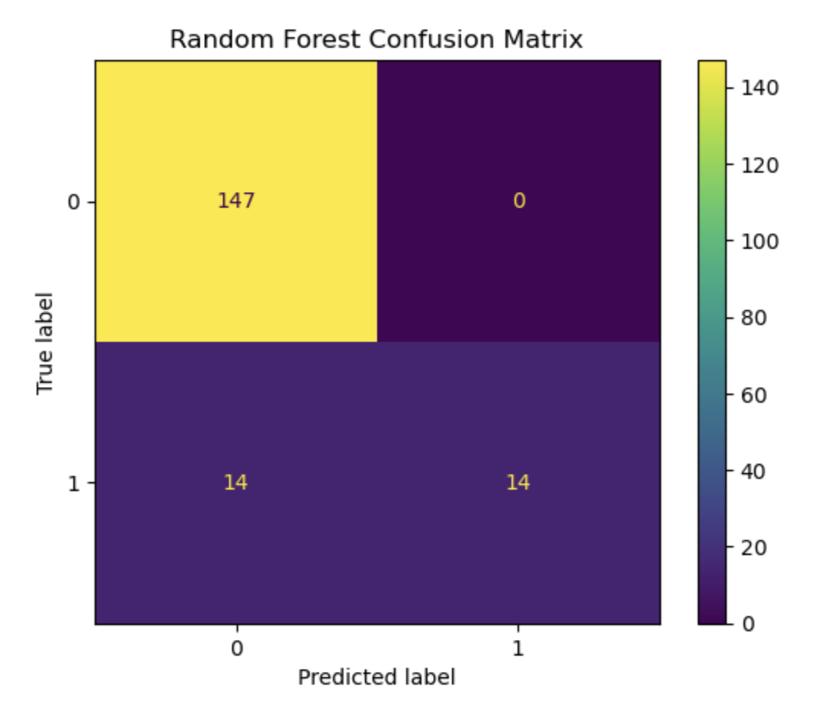

# TikTok Virality: How Well Does It Translate to Chart Success?

A machine learning analysis of whether viral success on TikTok predicts
commercial success on the Billboard Hot 100, and what factors beyond
virality influence which songs chart.

## Key findings
- **TikTok acts mainly as a rediscovery tool.** Of 260 charted songs,
  165 reached the Billboard Hot 100 *before* going viral on TikTok,
  76 charted the same year, and only 19 charted after, with a median
  lag of -2 years.
- **Virality alone is a weak predictor.** Only 24.42% of viral songs
  (TikTok track popularity of 70 or higher) charted on the Hot 100.
- **Random Forest outperformed Logistic Regression**, reaching a test-set
  F1 score of 0.67 for charting songs (vs. 0.38) and 0.92 accuracy
  (vs. 0.57). Logistic Regression caught more charting songs (recall of
  0.82 vs. 0.50), but with far more false positives.
- **Track popularity, duration, energy, speechiness, and tempo** were
  the strongest predictors. Viral status itself ranked outside the top
  10 once audio features were considered.

  

## Tech stack
- **Language:** Python
- **Libraries:** pandas, scikit-learn, Matplotlib, Seaborn, fuzzywuzzy, KaggleHub
- **Environment:** Jupyter

## Project structure
    ├── tiktok_billboard_analysis.ipynb   # Full analysis and models
    ├── requirements.txt                  # Python dependencies
    └── docs/                             # Charts used in this README

## Data
- [TikTok Popular Songs 2019-2022](https://www.kaggle.com/sveta151/datasets)
  (sveta151, Kaggle): audio features, metadata, and track popularity
- [Billboard "The Hot 100" Songs](https://www.kaggle.com/datasets/dhruvildave/billboard-the-hot-100-songs)
  (dhruvildave, Kaggle): weekly Hot 100 chart history since 1958

Both datasets download automatically through KaggleHub when the
notebook runs.

## Methods
1. **Cleaning:** merged four years of TikTok data, removed duplicates
   and missing values, and filtered outliers using the
   three-standard-deviation rule.
2. **Matching:** standardized song and artist names and used fuzzy
   string matching to link TikTok tracks to Billboard entries.
3. **Time-lag analysis:** measured the gap between each song's TikTok
   virality and its Billboard chart debut using the full chart history.
4. **Modeling:** trained Logistic Regression (with feature scaling) and
   a Random Forest tuned by grid search, both with balanced class
   weights. Models were evaluated with F1, recall, precision, confusion
   matrices, ROC curves, and 5-fold cross-validation.

  
  

## Limitations
- The viral threshold (track popularity of 70 or higher) is a heuristic
  and may miss other forms of virality.
- The TikTok datasets include only each year's top tracks.
- Billboard data captures only Hot 100 success, missing songs that
  succeeded commercially elsewhere.

## Running it yourself
1. Clone this repository and install dependencies:
   `pip install -r requirements.txt`
2. Open `tiktok_billboard_analysis.ipynb` in Jupyter and run all cells.
   If prompted, sign in with a free Kaggle account to download the data.

## Author
**Violet Fiorella** · [LinkedIn](https://linkedin.com/in/violetfiorella)
